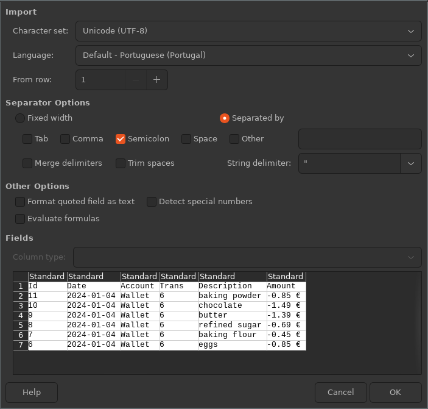

FINANCE CONTROL MANUAL
======================

This is a very basic program to control personal finances.  It depends on
[Python 3](https://python.org) and was thought to be
**used only from the command line**.  It supports multiple accounts with
possibly different currencies and transactions composed of multiple parcels,
each with its different tags.  Check the [USAGE] section for a more complete
overview of the program.

This is what the program IS NOT and CANNOT DO:

* It will not contact your home banking system;
* It will not scan your bills and insert them automatically;
* It will not produce beautiful (or even ugly) graphics;
* It will not analyse your savings and make predictions on where you will be in
  ten years;
* It will not automatically add interest rates to your savings accounts or
  loans.

This is what it CAN DO:

* Record your earnings and expenses exactly as you enter them in a standard
  SQLite database;
* List your earnings and expenses filtered by date, account and/or item tags;
* Export your listings to CSV files that can be further processed in other
  tools like spreadsheet applications.

Copyright (C) 2021 António Manuel Dias

contact: ammdias@gmail.com

website: [AMMDIAS GitHub](https://github.com/ammdias/finctrl)

CONTENTS
--------

  * [Changes history]
* [INSTALLATION]
* [USAGE]
  * [Command line interface]
  * [Starting and quitting the program]
  * [Getting help]
  * [Creating and opening a file]
  * [Default settings]
  * [Currencies]
  * [Accounts and Transactions]
  * [Correcting mistakes]
  * [Listing and exporting data]
  * [Advanced usage]
    * [Scripting]
    * [Backup and trim the database]
    * [Usage in MS Windows]
* [REFERENCE]
  * [Command's arguments reference]
  * [add]
  * [backup]
  * [bye]
  * [change]
  * [close]
  * [delete]
  * [help]
  * [list]
  * [open]
  * [set]
  * [show]
  * [source]
  * [trim]
  * [Database structure]
* [LICENSE]

INSTALLATION
------------

The instructions below are for installation on a modern Linux system.  They
may work on other modern Unix-like systems like BSD derivatives, including
MacOS, but that has not been tested and may require some tweaking.  Try it at
your own risk.  For MS Windows installation, refer to the section
[Usage in MS Windows].

1. Download and unzip the program's compressed file in a directory of your
   choosing.  To download the most recent version, check the [AMMDIAS
   GitHub page](https://github.com/ammdias/finctrl).

2. Open a terminal in the directory where the program was uncompressed and run
   the installation script with Python 3:

         $ python3 INSTALL.py

     You will be prompted for the installation directory --- i.e. the directory
     under which the folder containing all the application files will be placed
     --- and for the start link directory --- i.e. the directory where the
     symbolic link for the program will be created.

     The default directories will install the program for the current user only
     and are suited for single-user systems.  If you want to keep these
     settings, just press ENTER when prompted.  The program will be installed in
     the directory `$HOME/.local/lib/FinCtrl` and the symbolic link
     `$HOME/.local/bin/finctrl` will be created.  On most Linux systems the
     `$HOME/.local/bin` directory will be inserted in the execution PATH, if it
     exists. If it doesn't, you will have to add it manually.

     If you want to install the program for all the users of the system, you
     should change the directories accordingly, e.g. `/usr/local/lib` for the
     installation directory and `/usr/local/bin` for the start link.  Of
     course, you will need to run the installation script with administration
     privileges:

         $ sudo python3 INSTALL.py

     If a previous installation exists on the selected directory, you will be
     asked if you want to overwrite it.  Answer "`yes`" (or just "`y`") if that
     is the case or "`no`"/"`n`" if not.

3. Test that the installation was successful with the command:

       $ finctrl

   (this should open the program and present its default prompt)

   Now, enter the following commands:

       FinCtrl > help

   (the program should present a list of all the available commands)

       FinCtrl > bye

   (the program should close; you may also use the end-of-file
   command -- CTRL-D in Linux -- to close the program)

USAGE
-----

The purpose of this program is to control a user's personal finances by means of
a simple command line interface.  The user may configure several *accounts* (e.g.
a bank account, a savings account, the credit card account, etc.), each with its
own *currency*.  All operations on the accounts are entered as *transactions*,
each of which may be composed of several *parcels*.  This way, a supermarket bill
may be split on its items, so that the user may have a more fine control over
one's expenses.  Each parcel may also be tagged with several tags, allowing the
listing of the spendings (or earnings) by category.

The data is stored in standard [SQLite](https://sqlite.org) files (database
structure documented in the [Advanced Usage] section).  One file should be fine
for each user, but any number of them may be used if the user wants to split its
accounts over several subjects.

In this section I will try to give an overview of the program usage and its
possibilities.  I will do this in a *story-telling like* fashion, in each step
describing a new feature and the way to use it.  For the complete command
reference, you should then refer to the appropriate [REFERENCE] subsection.

### Command line interface

I assume that the user is familiarized with the *normal* way a command line
interface works --- basically, issuing commands at the prompt and reading the
program's answer, if any.  Some notes:

1. Blank lines will have no effect (will just be ignored);

2. If your system supports it, you will have command history in each session:
   press arrow up or `CTRL+P` for previous command / arrow down or `CTRL-N` for
   the next.  The usual control key bindings may also work:
      * `CTRL+A` to go to the beginning of the line;
      * `CTRL+E` to go to the end;
      * `CTRL+W` to delete previous word;
      * `CTRL+K` to delete from the cursor to the end of the line;

3. When entering a command longer than a screen line, you may split it over
   several lines by ending each line (except the last) with a single backslash:
   "`\`".  The prompt after that will change to a single colon (`:`) until you
   end the command.  If you make a mistake while entering a multi-line command,
   just finish the line with three consecutive backslashes (`\\\`) to discard
   the whole command. 

       FinCtrl > help bye
       Quit Finance Control.
      
       FinCtrl > help \
               : bye
       Quit Finance Control.
      
       FinCtrl > help \
               : something wrong \\\
       FinCtrl >  

4. All commands are case-sensitive, so `bye` is different from `BYE` or `Bye`
   --- the first will be recognised as a command and quit the program, but the
   others will originate an error message:

        FinCtrl > Bye
        *** Error: (Syntax) 'Bye' is not a recognized command.

   However, although the commands are case-sensitive, some arguments may be
   entered in any case, like account names or tags.  Also, the answer to inline
   questions may be given in lower or upper case.  Examples of those are given
   throughout this manual.

5. Some commands or options have a shortcut version that may be used
   interchangeably.  That will be indicated in the [REFERENCE] section and in
   the online help by enveloping the optional characters in square brackets.
   For example, the [show copyright] command may be entered as `show` or `sh`:

       FinCtrl > show copyright
       Finance Control 0.5
       (C) 2021 António Manuel Dias <ammdias@gmail.com>
       (...)

   or

       FinCtrl > sh copyright
       Finance Control 0.5
       (C) 2021 António Manuel Dias <ammdias@gmail.com>
       (...)

   This is explicitly stated in *help* text of the command:

       FinCtrl > help show
       Show a specific record's data:
               > sh[ow] acc[ount] ACCOUNT_NAME|ACCOUNT_ID
               (...)

6. Some commands will require information from the user, which must be provided
   following these general rules:

   * Positional arguments must follow the order they are listed in the command
     help or [REFERENCE] page.  Keyword arguments may be entered in any order,
     immediately after the key word.  Example:
            
         > command POS1 POS2 keyword_a ARG-A keyword_b ARG-B
         > command keyword_b ARG-B POS1 keyword_a ARG-A POS2 
     
     These commands would be valid and equivalent because the positional
     arguments are given in order (POS1 before POS2) and the keyword arguments
     (ARG-A and ARG-B) always follow the respective keyword (keyword_a and
     keyword_b).
 
   * Monetary amounts must consist of positive or negative integer or decimal
     values, using the decimal separator configured in the account they belong
     to.  Examples:  `123`, `123.24`, `-123.5`.
     Also, the decimal part may have at most the number of decimal places
     configured in the respective currency: the program will automatically
     truncate the remaining decimal places.  See the [Currencies] section below
     for details on how to find or change an account's decimal separator and
     number of decimal places.
     
   * Dates must be provided in the general form YEAR-MONTH-DAY.  The year may be
     omitted (the current year is implicit) or entered without the century (21st
     century is implicit).  The field separator may be a dash ('-') or a
     forward slash ('/'). Example: `2021-03-12`, `21-3-12` and `3/12` all refer
     to the March 12th of 2021 (assuming 2021 is the current year).

     The words `today` or `now` may be used in replacement of the current date.
     
   * Text values with spaces must be enveloped by single- or double-quotes.
     If a text value has single-quotes, use double-quotes to envelop it and
     vice-versa.
     
   * List values, used when entering tags, are text values separated by commas.
     Same rule applies as for text values: if any value of the list has spaces
     or quotes, the whole list must be enveloped by the other kind of quotes.
     Example:
     * `food,vegetables`
     * `'car, washing liquid'`

7. If a line of the output of a command is longer than the terminal width, it
   will be truncated and end with an ellipsis (`...`).  If the output has more
   lines than fit in the terminal height then the output will be split in pages
   and at the end of each page you will have the option to go to the next page
   (enter `next` or `n`), go back to the previous (enter `previous` or `p`),
   go to a specific page (enter its page number) or quit the presentation
   (enter `quit` or `q`). 

       FinCtrl > show license inline

       ### GNU GENERAL PUBLIC LICENSE

       Version 3, 29 June 2007

       Copyright (C) 2007 Free Software Foundation, Inc.
       <https://fsf.org/>

       Everyone is permitted to copy and distribute verbatim copies of this
       license document, but changing it is not allowed.

       Page 1 of 30. (N)ext / (P)revious / Page number / (Q)uit ? q

       FinCtrl >

### Starting and quitting the program

Assuming the program is correctly installed, to start the program just open a
terminal and type:

    $ finctrl

The prompt should change to the standard prompt:

    FinCtrl >

To close the program, use the [bye] command:

    FinCtrl > bye
    Bye.

The program will exit and print a goodbye message and the prompt will change to
the terminal's prompt.  Alternately, you may quit the program by typing the
system's end-of-file keyboard shortcut (CTRL-D in Linux) or `EOF`. 

### Getting help

There are not many things you can do after starting the program --- most require
an open file to work upon. One thing one can do is open a file but we will cover
that at the next subsection. Another is to show some information about the
program itself and the syntax and purpose of each command --- getting help.

If we use the [help] command without arguments, the program will print all the
available commands:

    FinCtrl > help

    Documented commands (type help <topic>):
    ========================================
    EOF  backup  ch      close  delete  list  open  sh    source
    add  bye     change  del    help    ls    set   show  trim  

We may also obtain help on a specific command by typing `help` followed by the
name of the command.  For example, for the [show] command:

    FinCtrl > help show
    Show a specific record's data:
            > sh[ow] acc[ount] ACCOUNT_NAME|ACCOUNT_ID
            > sh[ow] curr[ency] NAME
            > sh[ow] settings|manual [inline]|copyright|license [inline]
            > sh[ow] tr[ansaction] TRANSACTION_ID
 
The program will print a brief description of the purpose of the command
followed by a list of the command's allowed syntax. The following conventions
apply to every command description:

* Text between square brackets (`[]`) is optional --- you may enter it or not,
  as you wish;
* Text in lower case letters is mandatory and must be entered as-is;
* Several options separated by vertical bars (the *pipe* character, '`|`') mean
  that one and only one of them must be chosen;
* Finally, text in capital letters is information that must be provided or
  chosen by the user --- check in the commands' [REFERENCE] section for the
  precise type of information required.

The third syntax line of the example above explains how to use the [show]
command to display some information pertaining to the program.  The command may
be written as `show` or `sh` (the bracketed '`ow`' is optional) and must be
followed by only one of the options separated by vertical bars, `settings`,
`manual`, `copyright` or `license`.

For example, to show the program's copyright information, as we have seen in
previous section, we could type:

    FinCtrl > show copyright
    Finance Control 0.5
    (C) 2021 António Manuel Dias <ammdias@gmail.com>
    (...)

Both the `manual` and `license` information will be shown on a new web
browser window, assuming a browser is installed on your system:

    FinCtrl > sh manual
    The program's manual should be displayed in your browser.
    If this doesn't happen, please use the command:
        > show manual inline

The commands above take an optional argument, "`inline`", that directs the 
program to print the manual or license in the terminal instead of a web browser:

    FinCtrl > sh manual inline
    FINANCE CONTROL MANUAL
    ======================
    
    This is a very basic program to control personal finances.  It depends on
    (...)

Finally, we could also show the current program settings, but as they are
specific to each file (and kept in it), this command terminates with an
error message:

    FinCtrl > sh settings
    *** Error: 'show' command needs an open file.

The next section will cover how to work with files.

### Creating and opening a file

As stated earlier, the program keeps all information in
[SQLite](https://sqlite.org) files.  To open a file we use the [open] command:

    FinCtrl > open test.sqlite
    test.sqlite > 

The [open] command takes a single argument, the path to the file to be opened.
If a relative path is given, the directory where the program was started will
be the base directory. The tilde (`~`) may be used in substitution of the
user's home absolute path.  For example, in my case, if I used the command
`open ~/doc/accounting.sqlite` the opened file would be
`/home/antonio/doc/accounting.sqlite`.  This is standard Unix notation, but may
also be used in other systems.

I used the `.sqlite` extension because this way I can at a glance identify this
as an SQLite file when I list my system's directory, but the program doesn't
require any particular extension and you may even use files without one.

If the file does not exist, it will be created with default settings (more
about this in the subsection below). If it exists but is not a Finance Control
file, an error will be presented and the file will not be opened:

    FinCtrl > open testfile.txt
    *** Error: unable to open file. Reason:
        file is not a database

There is no need to close the open file before quitting the program, as all
changes are written to the file at the time they are made and the file will
be closed automatically.  Also, opening a file when another is already
opened will close this one previously.

Just for pure program symmetry, a [close] command is also available.  It will
close the current file and return the program to the initial state (no opened
files):

    test.sqlite > close
    FinCtrl > 

It is also possible to start the program with an opened file --- just pass its
path as argument to the program:

    $ finctrl test.sqlite
    test.sqlite >

You should have noticed that the prompt changes when a file is opened.  The
prompt is one of the program's settings and is stored in each file.  If no
change has been made, the prompt will be the file name by default.

### Default settings

Every opened file has a set of default settings that govern the behaviour of
some of the program's operations.  We can find the current file's settings with
the [show settings] command (a file must be already opened):

    test.sqlite > sh settings
    Prompt: test.sqlite > 
    Field separator for CSV files: ;
    Configured editor: 
    Default deposit text: Deposit
    Default withdrawal text: Withdrawal
    Default transfer text: Transfer
    Default currency: default
    
The settings are:

- *Prompt*: the prompt to be displayed when the file is opened;
- *Field separator for CSV files*: the character used to separate fields when
  exporting results to a CSV file;
- *Configured editor*: the program to edit external text files;
- *Default deposit*, *withdrawal* and *transfer text*: the text used as
  description for any of those operations if none is given when issuing the
  command;
- *Default currency*: the name of the currency to be used for any new account if
  no other is given at the time of creation.

All settings may be changed with the respective [set] command.  For example,
to change the prompt:

    test.sqlite > set prompt 'Test > '
    Test > 

Notice that the new prompt is given between quotes.  The reason for this is
that it contains spaces and would be interpreted as two different arguments if
not enveloped in quotes, which would result in an error:

    Test > set prompt Test >
    *** Error: 'set prompt' command takes a single argument:
        > set prompt TEXT

Most syntax error messages will also show the proper syntax of the command.

After changing the prompt, this setting will be preserved in the file and will
be used every time it is opened.  The other settings may be changed in the same
way.  To change the default currency, the name of an existing currency must be
used, otherwise an error will be shown:

    Test > set currency euro
    *** Error: unable to set currency. Reason:
        Currency not found.

### Currencies

In this program's context, a currency is just a collection of settings to
correctly display and scan monetary amounts.  We can list the configured
    currencies with the [list currencies] command:

    Test > list currencies
    
    Name    | Short name | Symbol | Position | Decimal places | Decimal separator
    --------+------------+--------+----------+----------------+------------------
    default |            |        | left     | 2              | .                

There is always at least one configured currency, named `default`.  We can
check a currency settings with the [show currency] command:

    Test > sh curr default
    Name: default
    Short name: 
    Symbol: 
    Symbol position: left
    Decimal places: 2
    Decimal separator: .

These are the properties of a currency:

- *Name*: the name for which the currency is know in the program.  You will
  need this name every time you have to identify the currency, for example, to
  assign it to an account.
- *Short name*: this is the abbreviation for the currency, like EUR for Euro or
  USD for United States Dollar.  Currently it has no purpose in the program.
- *Symbol*: the currency symbol, like '€' for Euro.  Currently it is not used by
  the program.
- *Position*: the position of the symbol when writing an amount. Must be `left`
  or `right`. Also with no current use in the program.
- *Decimal places*: this indicates the precision of the currency.  All amounts
  will be stored and displayed with this precision.  When entering an amount,
  only the decimal places configured in the respective currency will be stored
  --- all remaining decimal places will be discarded.
- *Decimal separator*: this is the symbol used to split a currency amount
  integer and decimal parts.  It will be used to display all currency
  quantities and to scan the quantities input by the user.

If all your accounts are in the same currency, you may use the default and just 
change its settings as you desire.  If not or if you prefer to have the
currency name correspond to its actual name, you must use the [add currency]
command.  Let's add the Euro currency to the Test file:

    Test > add curr Euro short EUR symbol € position right
    Test > 

The only required argument is the name of the currency to add, all others are
optional.  If an argument is not given, the corresponding value from the
`default` currency will be used.  We may confirm this showing the properties of
the currency we just added and comparing it to the default:

    Test > sh curr euro
    Name: Euro
    Short name: EUR
    Symbol: €
    Symbol position: right
    Decimal places: 2
    Decimal separator: .

Notice that although the first letter of the actual name of the currency is in
upper case we may use all lower case letters when identifying it to a command.
The names of currencies and accounts are not case-sensitive.

To change one of the values, we use the [change currency] command:

    Test > ch curr euro decsep ,
    Test >
    Test > sh curr euro
    Name: Euro
    Short name: EUR
    Symbol: €
    Symbol position: right
    Decimal places: 2
    Decimal separator: ,
    Test >

The euro decimal separator was changed to a comma.

Finally, we may want to make the Euro currency the default to be used on any
new account.  For this we use the [set currency] command:

    Test > set curr euro
    Test > 
    Test > sh settings
    Prompt: Test > 
    Field separator for CSV files: ;
    Configured editor: 
    Default deposit text: Deposit
    Default withdrawal text: Withdrawal
    Default transfer text: Transfer
    Default currency: Euro

### Accounts and Transactions

For the purpose of this program, accounts are the entities where money is
stored.  They will always have a balance, which is the total amount available,
and a *current* balance, which is the amount available at the current date.  We
can list the available accounts with the [list accounts] command:

    Test > list accounts
    *** Error: Empty set

Because none is configured yet, we get an error.  To add an account we use the
appropriately named command [add account].  The only required argument to this
command is the name of the account to be created, but we may also give it a
description and the currency that the account is in.  Let's create two accounts,
a *bank account* and a *pocket account*, for the hard currency we have with us:

    Test > add account Pocket
    Test > add acc Bank descr 'My bank account'
    Test >
    Test > ls acc
    
    ID | Name   | Description     | Balance
    ---+--------+-----------------+--------
     1 | Pocket |                 |    0,00
     2 | Bank   | My bank account |    0,00

When adding the *Pocket* account, I only provided its name and so the account
was created with no description, but for the *Bank* account (see that I used
the short command form, `add acc`) I gave it a description.  Both accounts
were created using the currency that we had set as default above, *Euro*.  One
obvious hint of this is the decimal separator on the balances listed by the
command `ls acc` (short for `list accounts`).  If we now change the *Euro*
currency separator back to the point symbol and list the accounts again, the
balances will reflect this change:

    Test > ch curr euro decsep .
    Test > ls acc
    
    ID | Name   | Description     | Balance
    ---+--------+-----------------+--------
     1 | Pocket |                 |    0.00
     2 | Bank   | My bank account |    0.00

Every change we make on a currency will be reflected on all accounts using
that currency.  To find all the details about an account, we use the [show
account] command:

    Test > show account bank
    Account ID: 2
    Name: Bank
    Description: My bank account
    Currency: Euro
    Balance (current): 0.00 (---)

All accounts may be identified by their name (not case-sensitive) or ID number.
For example, to show the details of the *Pocket* account:

    Test > sh acc 1
    Account ID: 1
    Name: Pocket
    Description: 
    Currency: Euro
    Balance (current): 0.00 (---)

The *current balance* is the balance of the present date that may be different
from the account balance if there are future transactions already entered (e.g.
when you know some amount will be withdrawn from an account at a specific date
on the future, you may enter that before the transaction actually happens).

Once we have our accounts set, we can start really using the program for its
intended purpose, tracking our personal earnings and expenses.  Every operation
on each of the accounts is a *transaction* and may be split into several
*parcels*.  For example, on a single trip to the supermarket one may buy sugar,
chocolate, flour, eggs and butter to make a chocolate cake.  Each of those
items would be a *parcel* and the sum of the parcels would comprise a
*transaction*.  Every transaction must have at least one parcel, although for
transactions with a single parcel there are shortcut commands to avoid having
to declare the parcel explicitly.  If this seems unclear, I hope when you start
using the program everything will become clear enough, so let's do that.

The first thing we must do is insert the initial amounts of each account. 

    Test > add transaction on pocket description 'Initial amount' \
         : date 2021-03-01 \
         : parcel "'Initial amount' 123.45 tags 'carry-over'"
    Transaction id: 1
    Test > 

This is the use of the [add transaction] command in its full splendor, so let
me explain it in detail.  The first thing to notice is that it is a multi-line
command: by placing a backslash character at the end of the first two lines I
tell the program that the command is not complete and carries on to the next.

Also of notice is that I used no *positional arguments*: all
user-provided data was entered by means of *keyword arguments*, some of
which are required and others optional.  The help page on this command is as
follows:

    > add tr[ansaction] on ACCOUNT_NAME|ACCOUNT_ID \
    :                   [neg] [descr[iption] TEXT] [date DATE] \
    :                   of AMOUNT | parcel "TEXT AMOUNT [tags LIST]" ...
 
 We can see that the `on` argument is required as is one (but not both) of the
 arguments `of` or `parcel`.  `neg`, `description` and `date` are optional.
 Let me detail the arguments used above:
 
- **on**: the account on which the transaction will be added, in this case the
  *Pocket* account;
- **description**: the description of this transaction that will be shown when
  listing transactions, in this case *Initial amount* which, because it has a
  space, must be enveloped in quotes;
- **date**: the date on which the transaction will be effective;
- **parcel**: the data of the single parcel of this transaction.

The **parcel** argument is a bit complex and deserves a detailed explanation of
its own.  In fact, it is almost like a command within [add transaction] as its
purpose is to add a parcel to it. If the transaction had multiple parcels, each
one would have its own **parcel** argument.

This *pseudo-command* has two required positional arguments: `TEXT`, the
description of the parcel (here the same as the transaction description,
*Initial amount*), and `AMOUNT`, the amount of the parcel.  It may also have a
keyword argument, `tags`, which must be a comma-separated list of the tags
to add to this parcel.

A very important fact to not forget when adding a parcel on the [add
transaction] command is that the whole parcel data must be within quotes.  This
is because the interpreter must perceive the complete data as a single argument.
Forgetting the quotes will result in an error being reported.  Because of this,
if the parcel description or any of the tags have spaces, they must also be
enveloped in quotes --- the other kind of the quotes used for the complete
parcel data.  That is why the parcel description above is within single-quotes
and the parcel data within double-quotes.

The optional arguments not used in this example were:

- **neg**: the only positional argument of the command, if used, would make all
  parcel amounts negative --- this may be nice when entering a complex bill, for
  example, so that the user doesn't need to keep adding the minus symbol to all
  the monetary values;
- **of**: this argument could actually have been used here --- it means that
  the transaction has a single parcel that will be added automatically with the
  amount and description of the whole transaction.

An easier way to add an amount to an account would be to use the [add deposit]
command.  This is a shortcut to the previous command and takes this form:

    > add deposit of AMOUNT on ACCOUNT_NAME|ACCOUNT_ID \
    :             [descr TEXT] [date DATE] [tags LIST]

Let's use it to add the initial amount to the *Bank* account:
        
    Test > add deposit of 5000 on bank date 3/1
    Transaction id: 2

You should have noticed that each time we add a transaction, the program
answers with the transaction identification.  We need this number every time
we have to refer to the transaction, like when we want to see its details with
the [show transaction] command:

    Test > sh tr 2
    Account: Bank (id: 2)
    Description: Deposit
    Total amount: 5000.00
    Date: 2021-03-01
    Parcels:
      (2) Deposit: 5000.00

Note that the description of the transaction (and also the implied parcel) was
set to *Deposit*.  This is due to one of the [default settings], the *default
deposit text*.  We could have set a different transaction description with the
`description` keyword and even add tags to the implied parcel using the `tags`
keyword.

Now that we have some transactions, we may list them all using the [list
transactions] command:

    Test > ls tr

    Account | Id | Date       | Description    | Total amount | Account balance
    --------+----+------------+----------------+--------------+----------------
    Pocket  |  1 | 2021-03-01 | Initial amount |       123.45 |          123.45
    Bank    |  2 | 2021-03-01 | Deposit        |      5000.00 |         5000.00

    Total amounts by currency:
        Euro: 5123.45

There is also a shortcut command to take some amount from an account, [add
withdrawal]:

    Test > add withdrawal on bank of 59.99 date 3/2 \
         : descr 'Phone bill, Feb. 2021' tags phone,comms
    Transaction id: 3

Some noteworthy things on this transaction:

* We may swap the order of the command arguments as I did here --- only the
  *positional arguments* need to appear on a specific order;

* I added two tags to the transaction, *phone* and *comms* --- this will allow
  us to list operations by tag, to better keep track on our spendings on
  specific items or categories (we will cover that topic later).

Actually, the tags are added to the implied parcel, as we may see in the details
of the transaction and have already seen in the full `add transaction` command:

    Test > sh tr 3
    Account: Bank (id: 2)
    Description: Phone bill, Feb. 2021
    Total amount: -59.99
    Date: 2021-03-02
    Parcels:
      (3) Phone bill, Feb. 2021: -59.99 (comms, phone)

Here, we may also see that although the amount given to the command was
positive (*59.99*), the transaction amount is negative.  This is the purpose of
having a shortcut command to describe a *deposit* and another to describe a
*withdrawal*.

There is one final shortcut transaction command, [add transfer], that moves an
amount from one account to another.  If I took 10 Euro from my bank account on
a ATM I could use this command to describe the operation:

    Test > add transfer of 10 from bank to pocket date 3/3 \
         : descr 'ATM withdrawal'
    Transaction id: 4
    Transaction id: 5

Wait! Why were two transactions added this time if I only issued one command?
We can find out listing the transactions:

    Test > ls tr
    
    Account | Id | Date       | Description           | Total amount | Account balance
    --------+----+------------+-----------------------+--------------+----------------
    Pocket  |  5 | 2021-03-03 | ATM withdrawal        |        10.00 |          133.45
    Pocket  |  1 | 2021-03-01 | Initial amount        |       123.45 |          123.45
    Bank    |  4 | 2021-03-03 | ATM withdrawal        |       -10.00 |         4930.01
    Bank    |  3 | 2021-03-02 | Phone bill, Feb. 2021 |       -59.99 |         4940.01
    Bank    |  2 | 2021-03-01 | Deposit               |      5000.00 |         5000.00

    Total amounts by currency:
        Euro: 5063.46

As can be seen is this listing, there is a transaction on the *Bank* account
and another on the *Pocket* account, which makes sense.  This listing also
shows some important features of transaction listings:

* The transactions are grouped by account;
* They are listed from the most recent down to the most ancient;
* The account balance is the amount available on each account after the
  operation has taken place.
* The 'Total amounts by currency' is a list of the sum of the 'Total amount'
  column by currency.  As all the transactions listed belong to accounts with
  the same currency, Euro, only one value is listed.

Probably it makes more sense to list the transactions on a single account, and
we may do that:

    Test > ls tr on bank
    
    Account | Id | Date       | Description           | Total amount | Account balance
    --------+----+------------+-----------------------+--------------+----------------
    Bank    |  4 | 2021-03-03 | ATM withdrawal        |       -10.00 |         4930.01
    Bank    |  3 | 2021-03-02 | Phone bill, Feb. 2021 |       -59.99 |         4940.01
    Bank    |  2 | 2021-03-01 | Deposit               |      5000.00 |         5000.00

    Total amounts by currency:
        Euro: 4930.01

Finally, although there is no need with so few transactions, we may also set
a date interval on the transactions listed:

    Test > ls tr on bank from 3/2 to today
    
    Account | Id | Date       | Description           | Total amount | Account balance
    --------+----+------------+-----------------------+--------------+----------------
    Bank    |  4 | 2021-03-03 | ATM withdrawal        |       -10.00 |         4930.01
    Bank    |  3 | 2021-03-02 | Phone bill, Feb. 2021 |       -59.99 |         4940.01

    Total amounts by currency:
        Euro: -69.99

If the `from` date is omitted, the listing starts at the first transaction; if
instead the `to` date is omitted, the listing ends in the most recent recorded
transaction. As we have seen earlier, if we give no date interval, all
transactions are listed.  "`today`" (or "`now`") are just shortcuts for the
present date (remember that you may add transactions for future dates).

We now have seen all the shortcut commands that allow us to add a single parcel
transaction.  To add transactions with multiple parcels we have two commands,
[add expense] and the `add transaction` that we have covered above.  They are
basically the same, the only difference being that the former will automatically
turn all parcel amounts to negative values, which is handy when you are adding
some kind of bill. Of course, you could do the same with the `add transaction`
command together with the `neg` argument.  Let's add the bill from the
supermarket trip to buy the ingredients for the chocolate cake mentioned
earlier:

* 6 eggs, 0.85€
* 1Kg baking flour, 0.45€
* 1Kg refined sugar, 0.69€
* 250g butter, 1.39€
* 200g black chocolate, 1.49€

We will use the `add expense` command:

    Test > add expense on bank descr Supermarket date 3/4 \
         : parcel "eggs 0.85 tags food,grocery" \
         : parcel "'baking flour' 0.45 tags food,grocery" \
         : parcel "sugar 0.69 tags food,grocery" \
         : parcel "butter 1.39 tags food,breakfast" \
         : parcel "chocolate 1.49 tags food,sweets"
    Transaction id: 6

To check if the transaction was inserted correctly, we can list the
transactions of the corresponding account:

    Test > ls tr on bank from 3/4
    
    Account | Id | Date       | Description | Total amount | Account balance
    --------+----+------------+-------------+--------------+----------------
    Bank    |  6 | 2021-03-04 | Supermarket |        -4.87 |         4925.14

    Total amounts by currency:
        Euro: -4.87

It seems alright, but we may also display the complete transaction:

    Test > sh tr 6
    Account: Bank (id: 2)
    Description: Supermarket
    Total amount: -4.87
    Date: 2021-03-04
    Parcels:
      (6) eggs: -0.85 (food, grocery)
      (7) baking flour: -0.45 (food, grocery)
      (8) sugar: -0.69 (food, grocery)
      (9) butter: -1.39 (breakfast, food)
      (10) chocolate: -1.49 (food, sweets)

### Correcting mistakes

It is human to err and that will probably happen a lot if you use this program.
Therefore, the program offers two general commands to correct the mistakes the
user can make, [change] and [delete], and two special commands that allow us to
expand some transaction already entered, [add parcel] and [add tag].  We'll
start with these.

If, when adding an expense, we forget a parcel it is possible to add it
afterwards with the command [add parcel] --- we only need to know the
transaction identification.  For example, when listing the last transaction of
the section above we may notice that the total amount is different from the
amount on the receipt.  Double-checking this we find that we forgot to add the
baking powder parcel.  Let's correct that adding that parcel to transaction 6:

    Test > add parcel 'baking powder' of 0.85 to 6
    Test > sh tr 6
    Account: Bank (id: 2)
    Description: Supermarket
    Total amount: -4.02
    Date: 2021-03-04
    Parcels:
      (6) eggs: -0.85 (food, grocery)
      (7) baking flour: -0.45 (food, grocery)
      (8) sugar: -0.69 (food, grocery)
      (9) butter: -1.39 (breakfast, food)
      (10) chocolate: -1.49 (food, sweets)
      (11) baking powder: 0.85

Oops, it seems I forgot to add the parcel tags and that the value must be
negative like the others.  No problem, we may also change that.  First, we add
the missing tags to parcel 11 (the baking powder, as listed in the
`show transaction` output) with the [add tag] command:

    Test > add tag food to 11
    Test > add tag grocery to 11

And now we use the [change parcel] command to change the amount of the same
parcel:

    Test > ch parcel 11 amount to -0.85

Printing the details on transaction 6 we can see that all is ok now:

    Test > sh tr 6
    Account: Bank (id: 2)
    Description: Supermarket
    Total amount: -5.72
    Date: 2021-03-04
    Parcels:
      (6) eggs: -0.85 (food, grocery)
      (7) baking flour: -0.45 (food, grocery)
      (8) sugar: -0.69 (food, grocery)
      (9) butter: -1.39 (breakfast, food)
      (10) chocolate: -1.49 (food, sweets)
      (11) baking powder: -0.85 (food, grocery)

The [change parcel] command may also be used to change a parcel's description:

    Test > ch parcel 8 descr to 'refined sugar'
    Test > sh tr 6
    Account: Bank (id: 2)
    Description: Supermarket
    Total amount: -5.72
    Date: 2021-03-04
    Parcels:
      (6) eggs: -0.85 (food, grocery)
      (7) baking flour: -0.45 (food, grocery)
      (8) refined sugar: -0.69 (food, grocery)
      (9) butter: -1.39 (breakfast, food)
      (10) chocolate: -1.49 (food, sweets)
      (11) baking power: -0.85 (food, grocery)

Another thing we can change is a tag name, but beware this will change this tag
for all parcels!  Just for an example, let's change *breakfast* to *dairy*:

    Test > ch tag breakfast to dairy
    Test > sh tr 6
    Account: Bank (id: 2)
    Description: Supermarket
    Total amount: -5.72
    Date: 2021-03-04
    Parcels:
      (6) eggs: -0.85 (food, grocery)
      (7) baking flour: -0.45 (food, grocery)
      (8) refined sugar: -0.69 (food, grocery)
      (9) butter: -1.39 (dairy, food)
      (10) chocolate: -1.49 (food, sweets)
      (11) baking power: -0.85 (food, grocery)

All parcels tagged with *breakfast* would now be tagged with *dairy* which may
not be what you intended... If you what you intended was to remove the tag
*breakfast* from parcel 9 only and to replace it with the tag dairy you could
have used the [delete tag] command and then [add tag]:

(if you try this after the previous command it will fail, because parcel 9 is
already tagged with *dairy*)

    Test > delete tag breakfast from 9
    Test > add tag dairy to 9

[delete tag] without a parcel number will delete the referred tag from
**all parcels**.

Another variant of the [change] command is [change transaction] and it may be
used, for example, to change a transaction description:

    Test > ls tr
    
    Account | Id | Date       | Description           | Total amount | Account balance
    --------+----+------------+-----------------------+--------------+----------------
    (...)
    Bank    |  2 | 2021-03-01 | Deposit               |      5000.00 |         5000.00
    (...)
    
    Test > change transaction 2 description to 'Initial amount'
    Test > ls tr
    
    Account | Id | Date       | Description           | Total amount | Account balance
    --------+----+------------+-----------------------+--------------+----------------
    (...)
    Bank    |  2 | 2021-03-01 | Initial amount        |      5000.00 |         5000.00
    (...)

More useful is probably changing a transaction from one account to another.
Let's say that we payed the chocolate ingredients in coin and not directly from
the bank.  To correct this we need to change transaction 6 to the *Pocket*
account:

    Test > ls tr
    
    Account | Id | Date       | Description           | Total amount | Account balance
    --------+----+------------+-----------------------+--------------+----------------
    Pocket  |  5 | 2021-03-03 | ATM withdrawal        |        10.00 |          133.45
    Pocket  |  1 | 2021-03-01 | Initial amount        |       123.45 |          123.45
    Bank    |  6 | 2021-03-04 | Supermarket           |        -5.72 |         4924.29
    Bank    |  4 | 2021-03-03 | ATM withdrawal        |       -10.00 |         4930.01
    Bank    |  3 | 2021-03-02 | Phone bill, Feb. 2021 |       -59.99 |         4940.01
    Bank    |  2 | 2021-03-01 | Initial amount        |      5000.00 |         5000.00
    
    Total amounts by currency:
        Euro: 5057.74

    Test > 
    Test > ch tr 6 account to pocket
    Test > ls tr
 
    Account | Id | Date       | Description           | Total amount | Account balance
    --------+----+------------+-----------------------+--------------+----------------
    Pocket  |  6 | 2021-03-04 | Supermarket           |        -5.72 |          127.73
    Pocket  |  5 | 2021-03-03 | ATM withdrawal        |        10.00 |          133.45
    Pocket  |  1 | 2021-03-01 | Initial amount        |       123.45 |          123.45
    Bank    |  4 | 2021-03-03 | ATM withdrawal        |       -10.00 |         4930.01
    Bank    |  3 | 2021-03-02 | Phone bill, Feb. 2021 |       -59.99 |         4940.01
    Bank    |  2 | 2021-03-01 | Initial amount        |      5000.00 |         5000.00
    
    Total amounts by currency:
        Euro: 5057.74

On the first listing, transaction 6 (the supermarket bill) was on the *Bank*
account and, after the [change transaction] command it is now on the *Pocket*
account --- all accounting operations were automatically done.  Changing the
date would be done in the same way.

Changing accounts and currencies is similar, with the [change account] and
[change currency] commands.  The only things that cannot be changed is a
currency's name and an account's currency.  Here's an example on how to change
an account's description:

    Test > ch acc pocket descr to 'Money with me'
    Test > ls acc
    
    ID | Name   | Description     | Balance
    ---+--------+-----------------+--------
     1 | Pocket | Money with me   |  127.73
     2 | Bank   | My bank account | 4930.01

    Total balances by currency:
        Euro: 5057.74

The last general command to correct mistakes is the [delete] command.  We
already covered both versions of the [delete tag] command above and although
the remaining delete commands are very similar, there are some issues that must
be mentioned for each one of them.

[delete parcel] and [delete transaction] take the identification number of the
item to remove and will remove it permanently from the database: there is no
way to recover them other than entering all its data again!

Previously I said that every transaction must have at least one parcel: well,
that is generally true and logic but you *can* remove the last parcel from a
transaction with the `delete transaction` command.  The transaction will be
empty and its total amount zero:

    Test > sh tr 3
    Account: Bank (id: 2)
    Description: Phone bill, Feb. 2021
    Total amount: -59.99
    Date: 2021-03-02
    Parcels:
      (3) Phone bill, Feb. 2021: -59.99 (comms, phone)
      
    Test > 
    Test > del parcel 3
    Test > sh tr 3
    Account: Bank (id: 2)
    Description: Phone bill, Feb. 2021
    Total amount: 0.00
    Date: 2021-03-02
    Parcels:
    
    Test >

I don't know how this could be useful, but... it's possible.  The only way to
revert it now is to enter the data again.  Nevertheless, the parcel ID will be
different --- it's a new parcel:

    Test > add parcel 'Phone bill, Feb. 2021' \
         : of -59.99 to 3 tags 'comms, phone'
    Test > sh tr 3
    Account: Bank (id: 2)
    Description: Phone bill, Feb. 2021
    Total amount: -59.99
    Date: 2021-03-02
    Parcels:
      (12) Phone bill, Feb. 2021: -59.99 (comms, phone)

[delete account] works in the same way, taking the account identification
number or account name and removing the account permanently.  However, extra
care should be taken when using this command, as it will also remove all of
the account's transactions (and their parcels, of course).  If you really want
to remove an account, be sure that you don't have any relevant information in
its transactions!

### Listing and exporting data

In the previous sections of this manual we already covered various forms of the
[list] command, like [list currencies] and [list accounts].  There is only one
detail we didn't mention: we may pass a currency or account name, respectively,
to list only that currency or account instead of all of them.  In short, it's
just an alternative way of visualizing the data to the [show] command:

    Test > ls acc bank
    
    ID | Name | Description     | Balance
    ---+------+-----------------+--------
     2 | Bank | My bank account | 4930.01

    Total balances by currency:
        Euro: 4930.01

We also covered in some detail the [list transactions] command with both its
filtering options, account and date.  The two remaining list commands are
related to tags: [list parcels] and [list tags].  With the first you may
list all parcels with certain tags:

    Test > ls parcels tagged grocery,dairy
    
    Id | Date       | Account | Trans | Description   | Amount
    ---+------------+---------+-------+---------------+--------
     6 | 2021-03-04 | Pocket  |     6 | eggs          |   -0.85
     7 | 2021-03-04 | Pocket  |     6 | baking flour  |   -0.45
     8 | 2021-03-04 | Pocket  |     6 | refined sugar |   -0.69
     9 | 2021-03-04 | Pocket  |     6 | butter        |   -1.39
    11 | 2021-03-04 | Pocket  |     6 | baking power  |   -0.85

    Total amounts by currency:
        Euro: -4.23

This command may also be filtered by date, with the keywords `from` and `to`,
like `list transactions`.  Note that you also get the total amount for that
listing -- and this is how we may find how much we are spending on certain
items on a certain period of time.

[list tags] lists all tags in use and their *frequency* --- the  number of
parcels tagged with each particular tag:

    Test > ls tags
    
    Tag        | Frequency
    -----------+----------
    carry-over |         1
    comms      |         1
    dairy      |         1
    food       |         6
    grocery    |         4
    phone      |         1
    sweets     |         1

Finally, all [list] commands accept one keyword argument, `tofile`, that
directs the program to export the data to a 
[CSV file](https://en.wikipedia.org/wiki/Comma-separated_values).  The keyword
must be followed by the file name (same rules apply as to the [open] command).
CSV files are very portable and supported by several applications and
programming languages, if you desire to process the exported data.  The command
below will export a list of the parcels with tag `food` to the file `food.csv`
in the current directory:

    Test > ls parcels tagged food tofile food.csv

After this you could open the file, for example, with a spreadsheet application
like LibreOffice.org Calc, Microsoft Office or even Google Docs.  When opening
the file, don't forget to choose the field separator character.  For example,
when opening the file with Calc I am presented with this dialog:

Notice that I changed the field separator to a semicolon (the default in this
program) and cleared all other options.  You may change the character used to
separate the fields with the [set csvsep] command.  LibreOffice.org has the
nice feature of previewing the content as it will be imported, that allows us
check if everything seems ok.

### Advanced usage

In the previous sections we covered the basic usage of Finance Control.  Here
we will skim over the last few bits that could facilitate the continuous usage
of the program.

#### Scripting

Using a command line may become tedious and treacherous, especially when
entering multi-line commands.  Imagine someone inserting a transaction with
a long list of parcels and, at the last, discovering that there's an error in
the first that will stop the command to be recognized by  the program.  It
would be frustrating!  To stop that from happening the program accepts commands
from a separate text file, using the [source] command.

The idea is simple: you prepare a simple-text file in your favourite editor,
where you can review the commands and correct any mistake, and then use the
[source] command to insert it into the database.  The commands in the text file
must match **exactly** the commands you would enter at the program command line.
This includes adding a backslash at the end of lines of a multi-line command.

Let's clarify this with a small example.  Create a text file with the content
below and name it `test.txt`:

    add expense on pocket \
        descr "Supermarket" date 3/12 \
        parcel "tomatoes 1.29 tags 'food,vegetables'" \
        parcel "onions 0.99 tags 'food,vegetables'" \
        parcel "lettuce 0.58 tags 'food,vegetables'" \
        parcel "cucumber 0.29 tags 'food,vegetables'" \
        parcel "'olive oil' 5.45 tags 'food,grocery'" \
        parcel "'wine vinegar' 1.05 tags 'food,grocery'" \
        parcel "salt 1.25 tags 'food,grocery'"
    
    add transfer of 60 from bank to pocket \
        descr 'ATM withdrawal' date 3/12

As you can see, these are just two commands, adding the expense of another trip
to the supermarket and an ATM withdrawal.  After saving the file, open the
program and the `test.sqlite` file we have been working on and then execute the
[source] command:

    Test > source test.txt
    
    add expense on pocket descr "Supermarket" date 3/12 parcel "tomatoes 1.29
    tags 'food,vegetables'" parcel "onions 0.99 tags 'food,vegetables'" parcel
    "lettuce 0.58 tags 'food,vegetables'" parcel "cucumber 0.29 tags 'food,
    vegetables'" parcel "'olive oil' 5.45 tags 'food,grocery'" parcel "'wine
    vinegar' 1.05 tags 'food,grocery'" parcel "salt 1.25 tags 'food,grocery'"
    Transaction id: 7
    
    add transfer of 60 from bank to pocket descr 'ATM withdrawal' date 3/12
    Transaction id: 8
    Transaction id: 9 

The commands are entered and *echoed* in the terminal (note the long line of
the `add expense` command).  Transactions 7, 8 and 9 were added, as we may
confirm list the transactions on the 12th of March:

    Test > ls tr from 3/12
    
    Account | Id | Date       | Description    | Total amount | Account balance
    --------+----+------------+----------------+--------------+----------------
    Pocket  |  9 | 2021-03-12 | ATM withdrawal |        60.00 |          176.83
    Pocket  |  7 | 2021-03-12 | Supermarket    |       -10.90 |          116.83
    Bank    |  8 | 2021-03-12 | ATM withdrawal |       -60.00 |         4870.01

    Total amounts by currency:
        Euro: -10.90

You could also [show] any of the transactions to double-check their correctness.

If there was an error in a command in the *script*, that particular command
would not be executed and an error would be displayed in the program's prompt.
To fix that error you need to open the text file and correct it.  Remember to
remove all the other commands or they will be executed again.

The [source] command has an extra option, `edit`, that automatically opens the
file in a text editor and executes it after you save the file and exit the
editor.  For this to work, the Finance Control program will scan the `VISUAL`
and `EDITOR` environment variables to find your favorite text editor.  If none
of those variables are set, or if you'd rather use another editor, you may set
the editor you prefer with the [set editor] command.  For example, if you want
to use *gedit*, the [GNOME text editor](https://wiki.gnome.org/Apps/Gedit), you
would enter:

    Test > set editor gedit

And, to edit and then execute the script above:

    Test > source edit test.txt

If all your work on the program is just executing a script, you could even
pass it as an argument to the program itself.  Consider this simple example
(save it as test-1.txt):

    open test.sqlite
    add deposit of 150 on bank descr 'Lottery prize' \
        date 3/15
    ls tr on bank from 2/1 to today tofile bank.csv

First, note that we start by opening the database file, then add a transaction
and finish by exporting the *Bank* account data to a `bank.csv` CSV file.  Now
we can pass this to the program directly from the system prompt:

    $ finctrl --source test-1.txt

The `--source` (or just `-s`) option of the Finance Control program tells it to
open the program, execute the commands in the file and finally quit the program
(check if the `bank.csv` file was created and that it is correct).

Of course, you could get the same effect redirecting the program's input stream
to the file, if your operating system supports it:

    $ finctrl < test-1.txt

Passing the script this way would not print the executed commands on the
terminal.  If you want that to happen, add "`set echo on`" to the top of the
text file (see the [set echo] reference page for details on this command).

#### Backup and trim the database

After a good amount of time using the program, a lot of data will be collected
and that could become a nuisance.  For example, that means you always have
to filter listings on starting date, to ignore old data.  To overcome this
problem you may use the [trim] command to remove old, unnecessary data.  This
command has two forms: [trim account], that operates on a single account, and
[trim storage], which will trim the complete database.

Trim will remove all transactions (and their parcels, of course) from the first
up to (and including) the date the user indicates, preserving the affected
accounts balance.  If no transaction remains on an account, a *carry-over*
transaction will be created with an amount identical to the account balance on
that date.

A good practice before using the `trim` command is to backup the database.  The
easiest way to do this is just copying the file using the operating system's
tools, but you may also do it from inside the program, with the [backup]
command.  Let's see a practical example of the usage of these two commands with
our little database.

    Test > backup test-20210315.sqlite

This command will backup the current database to the file passed as argument
(same rules for the file name as in the [open] command).  We may immediately
test the backup, opening it in the program:

    Test > open test-20210315.sqlite
    Test > ls acc
    
    ID | Name   | Description     | Balance
    ---+--------+-----------------+--------
     1 | Pocket | Money with me   |  176.83
     2 | Bank   | My bank account | 5020.01

    Total balances by currency:
        Euro: 5196.84

As this is a backup file, we should change its prompt so that when we open it
we are immediately alerted that we are on the backup file and not in the main
file.

    Test > set prompt 'Test-20210315 > '
    Test-20210315 > 

We can now return to the main file and trim the database.

    Test-20210315 > open test.sqlite
    Test > ls tr
    
    Account | Id | Date       | Description           | Total amount | Account balance
    --------+----+------------+-----------------------+--------------+----------------
    Pocket  |  9 | 2021-03-12 | ATM withdrawal        |        60.00 |          176.83
    Pocket  |  7 | 2021-03-12 | Supermarket           |       -10.90 |          116.83
    Pocket  |  6 | 2021-03-04 | Supermarket           |        -5.72 |          127.73
    Pocket  |  5 | 2021-03-03 | ATM withdrawal        |        10.00 |          133.45
    Pocket  |  1 | 2021-03-01 | Initial amount        |       123.45 |          123.45
    Bank    | 10 | 2021-03-15 | Lottery prize         |       150.00 |         5020.01
    Bank    |  8 | 2021-03-12 | ATM withdrawal        |       -60.00 |         4870.01
    Bank    |  4 | 2021-03-03 | ATM withdrawal        |       -10.00 |         4930.01
    Bank    |  3 | 2021-03-02 | Phone bill, Feb. 2021 |       -59.99 |         4940.01
    Bank    |  2 | 2021-03-01 | Initial amount        |      5000.00 |         5000.00

    Total amounts by currency:
        Euro: 5196.84

Look at the transactions and see that the first, on both accounts, is on March
1st and the last on March 12th in the *Pocket* account and on March 15th on the
*Bank* account.  Let's trim the database up to March 12.

    Test > trim storage upto 3/12
    Test > ls tr

    Account | Id | Date       | Description     | Total amount | Account balance
    --------+----+------------+-----------------+--------------+----------------
    Pocket  | 11 | 2021-03-12 | Trim carry-over |       176.83 |          176.83
    Bank    | 10 | 2021-03-15 | Lottery prize   |       150.00 |         5020.01
    Test > 

    Total amounts by currency:
        Euro: 326.83

As we can see, all transactions of the *Pocket* account were removed and a new
one was created with the account's carry-over balance.  On the *Bank* account
there was one remaining transaction and therefore no need to create the
carry-over transaction.

#### Usage in MS Windows

As this program is pure Python 3, it may be run in any operating system where
this language may be run, including Microsoft Windows, even though this system
is not know for a very friendly environment for the users of command-line tools.
Here I will provide some advice on how a Windows user could install and run the
program but be advised that **I DID NOT TEST THIS**, so I may have missed some
important detail.  Please contact me if that is the case.  In steps:

1. Start by downloading and installing the most recent version of the [Python
   language to your system](https://www.python.org/downloads/windows/).

   When prompted, answer yes to the question about adding Python to your
   system PATH.

2. Download the most recent version of *Finance Control* from 
   [AMMDIAS GitHub page](https://github.com/ammdias/finctrl) and uncompress it
   in a directory of your choosing.

3. Create a *batch file* to launch the program which will permit that you start
   it without the need to open a command line first. Here is an example that
   you may use to create your own:

       :: Sample Windows batch file to execute the Finance Control program
       :: on the file 'finctrl.sqlite'
    
       "C:\Program Files\Python\python.exe" ^
         C:\Users\USER\Programs\finctrl\finctrl.py ^
         C:\Users\USER\Documents\finctrl.sqlite
      
   On this batch file I assume that the Python executable is located in
   
       C:\Program Files\Python\Python.exe
       
   (you must check its actual location), that the program folder is in
   
       C:\Users\USER\Programs\finctrl
       
       
   (you should replace it with the path where you uncompressed the program) and
   that the database will be located in
   
       C:\Users\USER\Documents\finctrl.sqlite
       
   (you should replace this with the path where you wish the database to reside)
   
4. To start the program just open the Windows Explorer on the folder where you
   created the batch file and double click on it.  If you created the batch file
   on the Desktop (you can do that, of course), you just need to double-click
   its icon.  Provided everything is ok, a terminal window should open and you
   should see the program's prompt:
   
       finctrl.sqlite >

   Don't forget you can change the terminal window settings (color, font, height
   and width) if you don't like the Windows default.

5. (*Optional*) Set *Notepad* as the default text editor to use with the `source`
   command (please confirm the exact location of Notepad's executable):
   
       finctrl.sqlite > set editor "C:\Windows\System32\notepad.exe"

REFERENCE
---------

### Command's arguments reference

The command's arguments must follow these general rules:

- **ACCOUNT_ID**: account identification number (see [list accounts]).

- **ACCOUNT_NAME**: exact name of the account (see [list accounts]).  This
  argument is *not* case-sensitive.

- **AMOUNT**: an integer or decimal number.  The decimal part should be
  separated from the integer by the decimal separator character configured in
  the corresponding currency (see [show currency]).

- **CHARACTER**: a single character.  This argument *is* case-sensitive and
  cannot be a decimal digit (0-9).

- **DATE**: date in the general format YEAR-MONTH-DAY.  The field separators
  may be dashes ('-') or forward slashes ('/').  The year may be omitted (the
  current year is implicit) or without the century (21st century is implicit).

- **FILE**: path to the file to be opened or saved.  May be an absolute path or
  relative to the directory where the program was started.  The tilde ('~')
  will be replaced by the current user's home directory absolute path.
  
- **LEFT** / **RIGHT** / **ON** / **OFF**: exact text that should be entered.
  This argument is *not* case-sensitive.
  
- **LIST**:  comma-separated list of text arguments.  If the arguments contain
  spaces or quotes, the whole list must be enveloped in quotes (single or
  double).

- **NAME**: exact name of an existing currency, as entered in the database.
  (see [list currencies]).  This argument is *not* case-sensitive.

- **NUMBER**: integer number.

- **TEXT**: sequence of characters.  Must be enveloped in quotes (single or
  double) if it contains spaces or quotes.

- **TRANSACTION_ID**: transaction identification number (see
  [list transactions]).

- **PARCEL_ID**: parcel identification number (see [show transaction]).

  
### add

`add` is a *meta-command* with several available forms.  Below are their
descriptions:

#### add account
(shortcut: `add acc`)

Adds an account to the database.

    > add acc[ount] TEXT [descr[iption] TEXT] [curr[ency] NAME]

Arguments:

- **TEXT** (*positional*): name for the new account.  Should be short and
  without spaces, as it may be used for the account identification in other
  commands.
- **description** (*optional*): description of the new account.
- **currency** (*optional*): name of the currency for the new account.  If not
  provided, the default currency of the database will be used
  (see [show settings]).

#### add currency
(shortcut: `add curr`)

Adds a currency to the database.

    > add curr[ency] TEXT [short TEXT] [symbol TEXT] [position LEFT|RIGHT] \
    :     [decplaces NUMBER] [decsep CHARACTER]

Arguments:

- **TEXT** (*positional*): name for the new currency.  Should be short and
  without spaces as it will be used to identify the currency in other commands.
- **short** (*optional*): short name for the currency, like 'EUR' for Euro or
  'USD' for United States Dollar. Currently not used in the program.
- **symbol** (*optional*): symbol of the currency, like '€' for Euro or '$' for
  Dollar. Currently not used in the program.
- **position** (*optional*): position of the currency symbol relative
  the digits when printing an amount in the currency.  Currently not used in
  the program.
- **decplaces** (*optional*): number of decimal places for the currency.  This
  is the precision that will be used when storing and displaying amounts in the
  currency (all other digits will be discarded).
- **decsep** (*optional*): character used to separate the integer from the
  decimal part of amounts in the currency.  It will be used to print currency
  amounts as well to scan amounts input by the user.

All optional arguments not provided, with the exception of the short name, will
be copied from the currency named `default`.

#### add deposit

Adds a single-parcel transaction to the database.

    > add deposit of AMOUNT on ACCOUNT_NAME|ACCOUNT_ID \
    :     [descr[iption] TEXT] [date DATE] [tags LIST]

Arguments:

- **of**: total amount of the transaction.  Will be the amount of the single
  parcel.
- **on**: account on which the transaction will be added (see
  [list accounts]).
- **description** (*optional*): description of the transaction and parcel.  If
  not provided the *default deposit text* will be used (see [show settings]).
- **date** (*optional*): the date the transaction is effective.  If not
  provided, the current date will be used.
- **tags** (*optional*): list of tags to be added to the single parcel.

#### add expense
(shortcut: `add exp`)

Adds a negative transaction to the database.  All amounts provided will be
multiplied by `-1` before being added to the database.

    > add exp[ense] on ACCOUNT_NAME|ACCOUNT_ID \
    :     [descr[iption] TEXT] [date DATE] \
    :     of AMOUNT | parcel "TEXT AMOUNT [tags LIST]"...

Arguments:

- **on**: name or identification of the account on which the transaction will
  be added (see [list accounts]).
- **description** (*optional*): description of the transaction.
- **date** (*optional*): date on which the transaction will be effective. If
  not provided the current date will be used.
- **of**: amount of the single parcel transaction to be added.  If provided,
  the user may not provide any parcel.
- **parcel**: description of one parcel to be added to this transaction.
  Transactions may have any number of parcels.  The parcel description must be
  enveloped in quotes (single or double).  The parcel description must have
  these arguments:
  - **TEXT** (*positional*): the description of this parcel;
  - **AMOUNT** (*positional*): the amount of this parcel;
  - **tags** (*optional*): list of tags to be added to this parcel.

#### add parcel

Adds a parcel to an existing transaction.

    > add parcel TEXT of AMOUNT on TRANSACTION_ID [tags LIST]

Arguments:

- **TEXT** (*positional*): description of the parcel to be added.
- **of**: amount of the parcel to be added.
- **on**: identification of the transaction on which the parcel will be added
  (see [list transactions]).
- **tags** (*optional*): list of tags to be added to this parcel.

#### add tag

Adds a tag to an existing parcel.

    > add tag TEXT to PARCEL_ID

Arguments:

- **TEXT** (*positional*): the tag to add.
- **to**: identification of the parcel to which the tag will be added (see
  [show transaction]).

#### add transaction
(shortcut: `add tr`)

Adds a transaction to the database.

    > add tr[ansaction] on ACCOUNT_NAME|ACCOUNT_ID \
    :     [neg] [descr[iption] TEXT] [date DATE] \
    :     of AMOUNT | parcel "TEXT AMOUNT [tags LIST]"...

Arguments:

- **on**: name or identification of the account on which the transaction will
  be added (see [list accounts]).
- **neg** (*positional*, *optional*): indication that all amounts should be
  multiplied by `-1` before being added to the database.
- **description** (*optional*): description of the transaction.
- **date** (*optional*): date on which the transaction will be effective.  If
  not provided, the current date will be used.
- **of**: amount of the single parcel transaction to be added.  If provided,
  the user may not provide any extra parcel.
- **parcel**: description of one parcel to be added to this transaction.
  Transactions may have any number of parcels.  The parcel description must be
  enveloped in quotes (single or double).  The parcel description must have
  these arguments:
  - **TEXT** (*positional*): the description of this parcel;
  - **AMOUNT** (*positional*): the amount of this parcel;
  - **tags** (*optional*): list of tags to be added to this parcel.

#### add transfer

Adds two transactions to the database.  The first removes the amount from an
account and the second adds it to the other account, effectively transferring
it from one to the other.

    > add transfer of AMOUNT [descr TEXT] [date DATE] [tags LIST]
    :     from ACCOUNT_NAME|ACCOUNT_ID to ACCOUNT_NAME|ACCOUNT_ID
    
Arguments:

- **of**: total amount of the transaction.  Will be the amount of the single
  parcel of each transaction, being multiplied by `-1` on the first.
- **description** (*optional*): description of the transaction and parcels.  If
  not provided the *default transfer text* will be used (see [show settings]).
- **date** (*optional*): the date the transactions are effective.  If not
  provided, the current date will be used.
- **tags** (*optional*): list of tags to be added to the parcels.
- **from**: account from which the amount will be withdrawn (see
  [list accounts]).
- **to**: account on which the amount will be deposited (see [list accounts]).

#### add withdrawal

Adds a single-parcel negative transaction to the database.  The amount will be
multiplied by `-1` before being added to the database.

    > add withdrawal of AMOUNT on ACCOUNT_NAME|ACCOUNT_ID \\
    :     [descr TEXT] [date DATE] [tags LIST]

Arguments:

- **of**: total amount of the transaction.  Will be the amount of the single
  parcel.  Will be multiplied by `-1` before being added to the database.
- **on**: account on which the transaction will be added (see
  [list accounts]).
- **description** (*optional*): description of the transaction and parcel.  If
  not provided the *default withdrawal text* will be used (see [show settings]).
- **date** (*optional*): the date the transaction is effective.  If not
  provided, the current date will be used.
- **tags** (*optional*): list of tags to be added to the single parcel.

### backup

Copies current database to a new file.

    > backup FILE

Arguments:

- **FILE** (*positional*): path to the new file.  May be an absolute or
  relative path (relative to the directory the application was started).  The
  tilde ('`~`') may be used in substitution of the users' absolute home path.

### bye
(shortcuts: `EOF`; the system's end-of-file character)

Quits the Finance Control program.

    > bye|EOF

### change

`change` is a *meta-command* with several available forms.  Below are their
descriptions:

#### change account
(shortcuts: `change acc`; `ch account`; `ch acc`)

Changes an account's description.

    > ch[ange] acc[ount] ACCOUNT_NAME|ACCOUNT_ID descr[iption] to TEXT
    
Changes an account's name.

    > ch[ange] acc[ount] ACCOUNT_NAME|ACCOUNT_ID name to TEXT

Arguments:

- **ACCOUNT_NAME|ACCOUNT_ID** (*positional*): identification of the account to
  change.
- **to**: new description or name.

#### change currency
(shortcuts: `change curr`; `ch currency`; `ch curr`)

Changes a currency's settings:

    > ch[ange] curr[ency] NAME [short TEXT] \
    :          [symbol TEXT] [position LEFT|RIGHT] \
    :          [decplaces NUMBER] [decsep CHARACTER]

Arguments:

- **NAME** (*positional*): name of the currency to change.
- **short** (*optional*): new short name for the currency, like 'EUR' for Euro
  or 'USD' for United States Dollar. Currently not used in the program.
- **symbol** (*optional*): new symbol of the currency, like '€' for Euro or '$'
  for Dollar. Currently not used in the program
- **position** (*optional*): new position of the currency symbol relative the
  digits when printing an amount in the currency. Currently not used in the 
  program.
- **decplaces** (*optional*): new number of decimal places for the currency.
  This is the precision that will be used when storing and displaying amounts
  in the currency (all other digits will be discarded).
- **decsep** (*optional*): new character used to separate the integer from the
  decimal part of amounts in the currency. It will be used to print currency
  amounts as well to scan amounts input by the user.

#### change parcel
(shortcut: `ch parcel`)

Changes a parcel's description.

    > ch[ange] parcel PARCEL_ID descr[iption] to TEXT

Changes a parcel's amount.

    > ch[ange] parcel PARCEL_ID amount to AMOUNT

Arguments:

- **PARCEL_ID** (*positional*): identification number of the parcel to change.
- **to**: new text or amount.

#### change tag
(shortcut: `ch tag`)

Renames a tag.

    > ch[ange] tag TAG to TEXT

Arguments:

- **TAG** (*positional*): tag name to be renamed.
- **to**: new name for the tag.

#### change transaction
(shortcuts: `change tr`; `ch transaction`; `ch tr`)

Moves a transaction to another account.

    > ch[ange] tr[ansaction] TRANSACTION_ID acc[ount] \
    :          to ACCOUNT_NAME|ACCOUNT_ID

Changes a transaction's date.

    > ch[ange] tr[ansaction] TRANSACTION_ID date to DATE

Changes a transaction's description.

    > ch[ange] tr[ansaction] TRANSACTION_ID descr[iption] to TEXT
    
Arguments:

- **TRANSACTION_ID** (*positional*): identification number of the transaction
  to change.
- **to**: new transaction account, date or description.

### close

Closes the currently opened file.

    > close

### delete

`delete` is a *meta-command* with several available forms.  Below are their
descriptions:

#### delete account
(shortcuts: `delete acc`; `del account`; `del acc`)

Removes an account and all its transactions and corresponding parcels from the
database.

    > del[ete] acc[ount] ACCOUNT_NAME|ACCOUNT_ID

Arguments:

- **ACCOUNT_NAME|ACCOUNT_ID** (*positional*): identification of the account to
  be deleted from the database.

#### delete transaction
(shortcuts: `delete tr`; `del transaction`; `del tr`)

Removes a transaction and corresponding parcels from the database.

    > del[ete] tr[ansaction] TRANSACTION_ID

Arguments:

- **TRANSACTION_ID** (*positional*): identification of the transaction to delete.

#### delete parcel
(shortcut: `del parcel`)

Removes a parcel from a transaction.

    > del[ete] parcel PARCEL_ID

Arguments:

- **PARCEL_ID** (*positional*): identification of the parcel to delete.

#### delete tag
(shortcut: `del tag`)

Removes a tag from a parcel.

    > del[ete] tag TEXT from PARCEL_ID

Removes a tag from all parcels.

    > del[ete] tag TEXT

Arguments:

- **TEXT** (*positional*): tag to be deleted.
- *from*: identification of the parcel from which the tag will be deleted.

### help
(shortcut: `?`)

Displays all available commands or the purpose and syntax of a specific
command.

    > help|? [COMMAND]

Arguments:

- **COMMAND** (*positional*, *optional*): command to be displayed.

### list

`list` is a *meta-command* with several available forms.  Below are their
descriptions:

#### list accounts
(shortcuts: `list acc`; `ls accounts`; `ls acc`)

Displays a table with information about the requested accounts.

    > list|ls acc[ounts] [ACCOUNT_NAME] [tofile FILE]

Arguments:

- **ACCOUNT_NAME** (*positional*, *optional*): name of the account to be
  displayed.  If no account is requested, all accounts will be displayed.
- **tofile** (*optional*): path to the CSV file where the information should be
  saved. May be an absolute or relative path (relative to the directory the
  application was started).  The tilde ('`~`') may be used in substitution of
  the users' absolute home path.

#### list currencies
(shortcuts: `list curr`, `ls currencies`, `ls curr`)

Displays a table with information about the requested currencies.

    > list|ls curr[encies] [NAME] [tofile FILE]

Arguments:

- **NAME** (*positional*, *optional*): name of the currency to be displayed.
  If no currency is requested, all currencies will be displayed.
- **tofile** (*optional*): path to the CSV file where the information should be
  saved. May be an absolute or relative path (relative to the directory the
  application was started).  The tilde ('`~`') may be used in substitution of
  the user's absolute home path.

#### list parcels
(shortcut: `ls parcels`)

Displays a list of all parcels filtered by specific tags.

    > list|ls parcels tagged LIST [from DATE] [to DATE] [tofile FILE]

Arguments:

- **LIST** (*positional*): list of tags to search.
- **from** (*optional*): lower date limit of the results to be displayed.  If no
  date is given, the results will include all parcels from the first recorded
  to the upper limit.
- **to** (*optional*): upper date limit of the results to be displayed.  If no
  date is given, the results will include all parcels from the lower limit to
  the last recorded one.
- **tofile** (*optional*): path to the CSV file where the information should be
  saved. May be an absolute or relative path (relative to the directory the
  application was started).  The tilde ('`~`') may be used in substitution of
  the user's absolute home path.

#### list tags
(shortcut: `ls tags`)

Displays a list of all recorded tags and the number of parcels where each is
used.

    > list|ls tags [tofile FILE]

Arguments:

- **tofile** (*optional*): path to the CSV file where the information should be
  saved. May be an absolute or relative path (relative to the directory the
  application was started).  The tilde ('`~`') may be used in substitution of
  the users' absolute home path.

#### list transactions
(shortcuts: `list tr`; `ls transactions`; `ls tr`)

Displays a list of transactions filtered by specific criteria.

    > list|ls tr[ansactions] [on ACCOUNT_NAME|ACCOUNT_ID] \\
    :         [from DATE] [to DATE] [tofile FILE]

Arguments:

- **on** (*optional*): account identification of the transactions to be
  displayed.  If no account is given, transactions from all accounts will be
  displayed, grouped by account.
- **from** (*optional*): lower date limit of the results to be displayed.  If no
  date is given, the results will include all transactions from the first
  recorded to the upper limit.
- **to** (*optional*): upper date limit of the results to be displayed.  If no
  date is given, the results will include all transactions from the lower limit
  to the last recorded one.
- **tofile** (*optional*): path to the CSV file where the information should be
  saved. May be an absolute or relative path (relative to the directory the
  application was started).  The tilde ('`~`') may be used in substitution of
  the users' absolute home path.
  

### open

Opens a Finance Control database file.

    > open FILE

Arguments:

- **FILE** (*positional*): path to the file to be opened.  May be an absolute
  or relative path (relative to the directory the application was started).
  The tilde ('`~`') may be used in substitution of the users' absolute home
  path.

### set

`set` is a *meta-command* with several available forms.  Below are their
descriptions:

#### set csvsep

Sets the field separator character for CSV files.

    > set csvsep CHARACTER

Arguments:

- **CHARACTER** (*positional*): the character to be set as a field separator
  for CSV files.

#### set currency

Sets the default currency to be used for new accounts.

    > set curr[ency] NAME

Arguments:

- **NAME** (*positional*): the name of the currency to be used as default for
  new accounts.

#### set deposit

Sets the default description to be used for new deposits.

    > set deposit descr[iption] TEXT
    
Arguments:

- **TEXT** (*positional*): the description to be used as default for new
  deposits.

#### set echo

Enables or disables command echo (repeat) on the prompt.

    > set echo ON|OFF

Arguments:

- **ON|OFF** (*positional*): `on` enables command echo, `off` disables it.
  This argument is *not* case-sensitive.

#### set editor

Sets the external text editor to open the files passed to the [source] command.

    > set editor TEXT

Arguments:

- **TEXT** (positional): the command to launch the preferred text editor
  (e.g. `vim`, `nano`, `gedit` or `notepad.exe`).
  

#### set prompt

Sets the prompt to be used for the current file.

    > set prompt TEXT

Arguments:

- **TEXT** (*positional*): the text to be used as prompt when the current file
  is opened.

#### set transfer

Sets the default description to be used for new account transfers.

    > set transfer descr[iption] TEXT

Arguments:

- **TEXT** (*positional*): the description to be used for new account
  transfers.

#### set withdrawal

Sets the default description to be used for new withdrawals.

    > set withdrawal descr[iption] TEXT

Arguments:

- **TEXT** (*positional*): the default description to be used for new
  withdrawals.
  

### show

`show` is a *meta-command* with several available forms.  Below are their
descriptions:

#### show account
(shortcuts: `show acc`; `show account`; `sh acc`)

Displays detailed information about an account.

    > sh[ow] acc[ount] ACCOUNT_NAME|ACCOUNT_ID

Arguments:

- **ACCOUNT_NAME|ACCOUNT_ID** (*positional*): identification of the account to
  be displayed.  This argument is not case-sensitive.

#### show copyright
(shortcut: `sh copyright`)

Displays copyright information.
    
    > sh[ow] copyright

#### show currency
(shortcuts: `show curr`; `sh currency`; `sh curr`)

Displays detailed information about a currency.

    > sh[ow] curr[ency] NAME

Arguments:

- **NAME** (*positional*): the name of the currency to be displayed.  This
  argument is *not* case-sensitive.

#### show license
(shortcut: `sh license`)

Displays the Finance Control program's copyright license.

    > sh[ow] license [inline]
    
Arguments:

- **inline** (*positional*, *optional*): instructs the program to display the
  license on the terminal.  If not present, the license text will be displayed
  on a web browser if one is available.

#### show manual
(shortcut: `sh manual`)

Displays this manual.
    
    > sh[ow] manual [inline]

Arguments:

- **inline** (*positional*, *optional*): instructs the program to display the
  manual on the terminal.  If not present, the manual will be displayed on a
  web browser, if one is available.
 

#### show settings
(shortcut: `sh settings`)

Displays the default program settings of the opened file.

    > sh[ow] settings

#### show transaction
(shortcuts: `show tr`; `sh transaction`; `sh tr`)

Displays detailed information about a transaction, including its parcels.

    > sh[ow] tr[ansaction] TRANSACTION_ID

Arguments:

- **TRANSACTION_ID** (*positional*): identification number of the transaction
  to be displayed.

### source

Executes commands from an external text file.  Optionally, opens an external
text editor to edit the file prior to executing its commands.

    > source [edit] FILE

Arguments:

- **edit** (*positional*, *optional*): instructs the program to open the file
  on an external text editor before executing the commands.  If no editor is
  explicitly configured, via the [set editor] command, the program will scan
  the `VISUAL` and `EDITOR` environment variables to discover the editor to
  launch. If no editor is configured on those variables, an error will be
  output and no editor will be launched.  The commands in the text file will be
  executed after closing the editor (remember to save the file).
- **FILE** (*positional*): path to the file to be executed.  May be an absolute
  or relative path (relative to the directory the application was started).
  The tilde ('`~`') may be used in substitution of the users' absolute home
  path.

### trim

`trim` is a *meta-command* with several available forms.  Below are their
descriptions:

#### trim account

Removes all transactions prior to the specified date from an account.  If no
transaction remains, one will be created with the amount of the account balance
at that date.

    > trim acc[ount] ACCOUNT_NAME|ACCOUNT_ID upto DATE

Arguments:

- **ACCOUNT_NAME|ACCOUNT_ID** (*positional*): account identification from which
  the transactions will be removed.
- **DATE**: date up to which the transactions will be removed.

#### trim storage

Removes all transactions prior to the specified date from the database.  If no
transaction remains on an account, one will be created with the amount of the
account balance at that date.

    > trim storage upto DATE

Arguments:

- **DATE**: date up to which the transactions will be removed.

### Database structure

Below are the instructions used to create the database on SQLite, which reflect
its schema:

    CREATE TABLE metadata (
         key         text not null,
         value       text not null,
         primary key (key)
    );
    
    CREATE TABLE currencies (
        name        text not null,
        short_name  text,
        symbol      text,
        symbol_pos  text,
        dec_places  integer,
        dec_sep     text,
        primary key (name)
    );

    CREATE TABLE accounts (
        key         integer,
        name        text not null,
        balance     integer,
        descr       text,
        currency    text,
        primary key (key),
        foreign key (currency) references currencies(name)
    );
    
    CREATE TABLE transactions (
        key         integer,
        account     integer not null,
        date        text,
        descr       text,
        amount      integer not null,
        accbalance  integer not null,
        primary key (key),
        foreign key (account) references accounts(key)
    );
    
    CREATE TABLE parcels (
        key         integer,
        trans       integer not null,
        descr       text,
        amount      integer not null,
        primary key (key),
        foreign key (trans) references transactions(key)
    );
    
    CREATE TABLE parceltags (
        parcel      integer not null,
        tag         text not null,
        primary key (parcel, tag),
        foreign key (parcel) references parcels(key)
    );

    CREATE TRIGGER del_currency before delete on currencies
    begin
        delete from accounts where currency=old.name;
    end;
    
    CREATE TRIGGER del_account before delete on accounts
    begin
        delete from transactions where account=old.key;
    end;
    
    CREATE TRIGGER del_transaction before delete on transactions
    begin
        delete from parcels where trans=old.key;
    end;

    CREATE TRIGGER del_parcel after delete on parcels
    begin
        delete from parceltags where parcel=old.key;
    end;

LICENSE
-------

Copyright (C) 2021 António Manuel Dias

contact: ammdias@gmail.com

website: [AMMDIAS](https://ammdias.duckdns.org/downloads)

This program is free software: you can redistribute it and/or modify
it under the terms of the GNU General Public License as published by
the Free Software Foundation, either version 3 of the License, or
(at your option) any later version.

This program is distributed in the hope that it will be useful,
but WITHOUT ANY WARRANTY; without even the implied warranty of
MERCHANTABILITY or FITNESS FOR A PARTICULAR PURPOSE.  See the 
GNU General Public License for more details.

You should have received a copy of the [GNU General Public
License](http://www.gnu.org/licenses) along with this program.  If not,
please check the site above.

